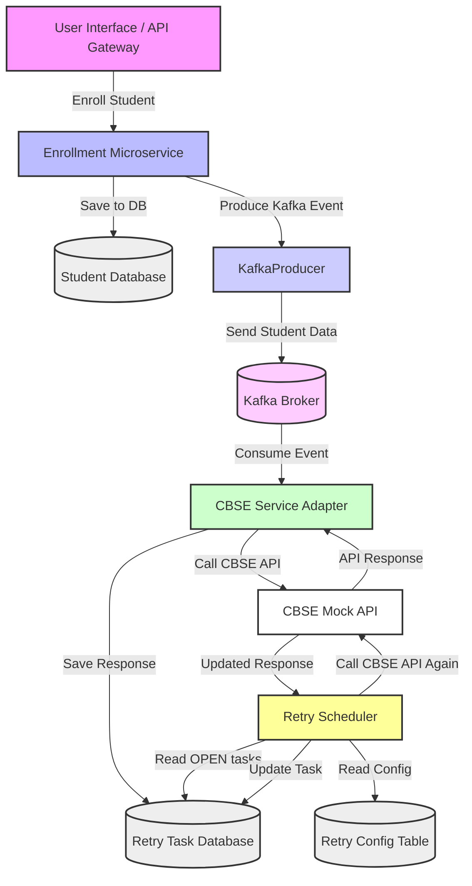

## School Enrollment Microservice Architecture

This microservice handles student enrollment, stores data, and interacts with a mock CBSE API via Kafka and retry logic.

```mermaid
graph TD

%% Services
UI[User Interface / API Gateway] -->|Enroll Student| EnrollmentService

EnrollmentService[Enrollment Microservice] -->|Save to DB| StudentDB[(Student Database)]
EnrollmentService -->|Produce Kafka Event| KafkaProducer

KafkaProducer -->|Send Student Data| KafkaBroker[(Kafka Broker)]
KafkaBroker -->|Consume Event| KafkaConsumer

KafkaConsumer[CBSE Service Adapter] -->|Call CBSE API| CBSEMockAPI[CBSE Mock API]
CBSEMockAPI -->|API Response| KafkaConsumer

KafkaConsumer -->|Save Response| RetryTaskDB[(Retry Task Database)]

RetryScheduler[Retry Scheduler] -->|Read OPEN tasks| RetryTaskDB
RetryScheduler -->|Read Config| RetryConfigTable[(Retry Config Table)]
RetryScheduler -->|Call CBSE API Again| CBSEMockAPI
CBSEMockAPI -->|Updated Response| RetryScheduler
RetryScheduler -->|Update Task| RetryTaskDB

%% Styling
style UI fill:#f9f,stroke:#333,stroke-width:2px
style EnrollmentService fill:#bbf,stroke:#333,stroke-width:2px
style KafkaProducer fill:#ccf,stroke:#333,stroke-width:2px
style KafkaBroker fill:#fcf,stroke:#333,stroke-width:2px
style KafkaConsumer fill:#cfc,stroke:#333,stroke-width:2px
style CBSEMockAPI fill:#fff,stroke:#333,stroke-width:2px
style RetryTaskDB fill:#eee,stroke:#333,stroke-width:2px
style RetryConfigTable fill:#eee,stroke:#333,stroke-width:2px
style RetryScheduler fill:#ff9,stroke:#333,stroke-width:2px
style StudentDB fill:#eee,stroke:#333,stroke-width:2px
```