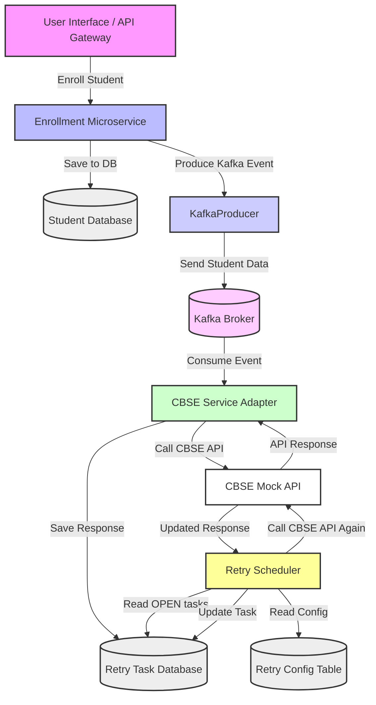

## School Enrollment Microservice Architecture

This microservice handles student enrollment, stores data, and interacts with a mock CBSE API via Kafka and retry logic.

---
## How It Works

1. **Consume Event** → Generate retry event if failure (not duplicate).
2. **Scheduler** (every 2 mins) → Picks OPEN events due for retry.
3. **Process Event** → HTTP status via Aadhaar digit logic.
4. **Update Status** → CLOSED/FAILED/OPEN based on rules and retry count.
5. **Persist Change** → Save updated `RetryEvent`.
---
## Tech Stack

- Kotlin + Spring Boot (WebFlux + Scheduling)
- Reactive MongoDB (Spring Data)
- Apache Kafka
- REST Controller (Spring WebFlux)
- Gradle build

---
## Design Philosophy
This system follows an event-driven, resilient architecture with clear separation of concerns.

- **Asynchronous** onboarding via Kafka.
- **Failure handling** with RetryEvent persisted for audit and retry.
- **Automatic retries** based on configurable policies (max attempts, interval).
- **Idempotent processing** to prevent duplicates.
- **Modular services**: Consumers handle events, schedulers manage retries, and evaluators decide outcomes.


---

### API Endpoints

#### Retry Event APIs

| Method | Endpoint            | Description                                     |
| ------ | ------------------- | ----------------------------------------------- |
| `POST` | `/api/retry-events` | Manually create a new RetryEvent (for testing). |

**Sample Request:**

```json
POST /api/retry-events
Content-Type: application/json

{
  "aadhaar": "029999999902",
  "taskType": "CBSE_ONBOARDING",
  "requestMetadata": {
    "aadhaar": "029999999902",
    "name": "Joe",
    "rollNo": "1002",
    "studentClass": "10",
    "school": "ABC Public School",
    "dob": "2012-12-31"
  },
  "responseMetadata": {
    "status": 500,
    "message": "INTERNAL_SERVER_ERROR"
  },
"createdDate": "2025-06-12T07:55:17",
"lastRunDate": "2025-06-12T07:55:17",
"nextRunTime": "2025-06-12T07:56:17",
"version": 1,
"status": "OPEN"
}
```

---

#### Student APIs

| Method | Endpoint        | Description                    |
| ------ | --------------- | ------------------------------ |
| `POST` | `/api/students` | Save a new student to MongoDB. |

**Sample Request:**

```json
POST /api/students
Content-Type: application/json

{
  "aadhaar": "123456789012",
  "name": "joe",
  "rollNo": "1001",
  "studentClass": "10",
  "school": "XYZ Public School",
  "dob": "2010-05-15"
}
```

---

## Postman Collection – Testing Setup

The Postman collection contains **5 requests**, each crafted to simulate and observe different retry scenarios:

### Event Simulation

| Request No. | Name                              | Purpose                                                                  |
| ----------- | --------------------------------- | ------------------------------------------------------------------------ |
| 1           | **Student Onboarding - OK**       | Sends an event with Aadhaar ending in `0` → gets `HTTP 200` → `CLOSED`   |
| 2           | **Student Onboarding - Conflict** | Aadhaar ends in `1` → simulates already enrolled → `HTTP 409` → `FAILED` |
| 3           | **Student Onboarding - Error**    | Aadhaar ends in `2` → simulates internal error → `HTTP 500` → `OPEN`     |

### Retry Flow Testing

| Request No. | Name                                         | Purpose                                                                                                |
| ----------- | -------------------------------------------- | ------------------------------------------------------------------------------------------------------ |
| 4           | **Create RetryEvent - Will Become OK**       | Directly inserts a `RetryEvent` with Aadhaar ending in `0`, simulating a retriable error that resolves |
| 5           | **Create RetryEvent - Will Become Conflict** | Inserts a `RetryEvent` with Aadhaar ending in `1`, simulating error that becomes unrecoverable (`409`) |

These help you:

* Verify the retry logic path (OPEN → CLOSED/FAILED).
* Inspect how MongoDB updates over retries.
* Observe system behavior with simulated external responses.

---

## Flow

